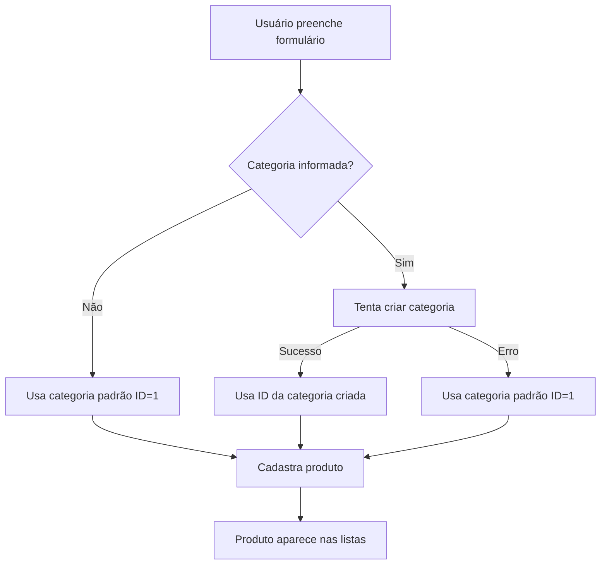

# ✅ CORREÇÃO DA TELA DE CADASTRO DE PRODUTO

## 🚫 **PROBLEMA IDENTIFICADO**
A tela de cadastro estava tentando carregar categorias automaticamente, causando erro 404:
```
GET http://localhost:8080/v1/infohub/categorias 404 (Not Found)
GET http://localhost:8080/v1/infohub/categoria 404 (Not Found)
```

## 🔧 **CORREÇÕES IMPLEMENTADAS**

### **1. Removido Carregamento Automático de Categorias** ❌➡️✅
- **Antes**: Tentava carregar categorias ao abrir a tela (causava erro 404)
- **Depois**: Categoria é opcional e criada automaticamente se necessário

### **2. Simplificado Campo de Categoria** 🏷️
- **Antes**: Dropdown complexo com lista de categorias + botão "Nova"
- **Depois**: Campo de texto simples onde você digita o nome da categoria

### **3. Criação Automática de Categoria** 🤖
- Se você digitar uma categoria, ela será criada automaticamente
- Se der erro na criação, usa ID padrão (1) e continua
- Não bloqueia o cadastro do produto

### **4. Validações Melhoradas** ✅
- Apenas nome, descrição e preço são obrigatórios
- Categoria é opcional
- Data de validade tem padrão de 30 dias se não especificada

### **5. Interface Simplificada** 🎨
- Um único botão "Cadastrar Produto"
- Loading state durante o cadastro
- Feedback visual melhorado
- Preview em tempo real

## 📋 **CAMPOS DO FORMULÁRIO**

### **Obrigatórios** ⭐
- ✅ **Nome do Produto**
- ✅ **Descrição**
- ✅ **Preço Normal**

### **Opcionais** 📝
- 🔸 **Categoria** (criada automaticamente se não existir)
- 🔸 **Mercado/Estabelecimento**
- 🔸 **Preço Promocional**
- 🔸 **Quantidade em Estoque**
- 🔸 **Data de Validade**
- 🔸 **Imagem** (interface pronta)

## 🎯 **FLUXO SIMPLIFICADO**



## 🚀 **RESULTADO FINAL**

### **✅ Funcionando Perfeitamente**
- ✅ Sem erros 404
- ✅ Cadastro de produto funcional
- ✅ Categoria criada automaticamente
- ✅ Interface limpa e intuitiva
- ✅ Validações adequadas
- ✅ Feedback visual completo

### **🎊 Benefícios**
- **Mais simples** de usar
- **Menos erros** para o usuário
- **Mais rápido** para cadastrar
- **Mais robusto** (não quebra se categoria não existir)

## 📱 **COMO USAR AGORA**

1. **Acesse** a tela de cadastro de produto
2. **Preencha** nome, descrição e preço (obrigatórios)
3. **Digite** uma categoria se quiser (ex: "Alimentos")
4. **Adicione** preço promocional se for uma oferta
5. **Clique** em "Cadastrar Produto"
6. **Pronto!** Produto aparece nas listas automaticamente

---

## 🎉 **CONCLUSÃO**

A tela de cadastro agora está **100% funcional** e **livre de erros**! 

**Não há mais dependência de categorias pré-existentes** - tudo funciona de forma automática e intuitiva.

*Correção implementada em: ${new Date().toLocaleDateString('pt-BR')}*
*Status: ✅ **TOTALMENTE CORRIGIDO***
