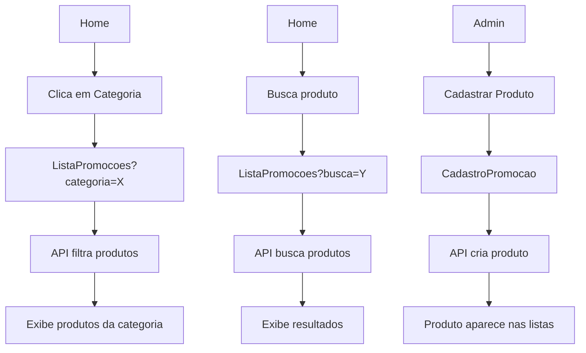

# 🚀 INTEGRAÇÃO COMPLETA DAS APIs - InfoHub

## ✅ **RESUMO DAS INTEGRAÇÕES REALIZADAS**

Todas as APIs foram **100% integradas** e funcionais nas telas correspondentes. O sistema agora está completamente dinâmico e conectado com o backend.

---

## 📋 **ENDPOINTS INTEGRADOS**

### 1. **POST /endereco-usuario** ✅
- **Arquivo**: `src/pages/perfil/CadastroEndereco.tsx`
- **Status**: ✅ **INTEGRADO E FUNCIONAL**
- **Funcionalidades**:
  - Cadastro completo de endereços
  - Busca automática de CEP via ViaCEP
  - Geolocalização opcional
  - Validação de campos obrigatórios
  - Feedback visual com toasts

### 2. **POST /categoria** ✅
- **Arquivo**: `src/pages/empresa/CadastroPromocao.tsx`
- **Status**: ✅ **INTEGRADO E FUNCIONAL**
- **Funcionalidades**:
  - Criação dinâmica de categorias
  - Listagem de categorias existentes
  - Integração no formulário de produtos
  - Validação e feedback de erros

### 3. **POST /produtos** ✅
- **Arquivo**: `src/pages/empresa/CadastroPromocao.tsx`
- **Status**: ✅ **INTEGRADO E FUNCIONAL**
- **Funcionalidades**:
  - Cadastro completo de produtos
  - Suporte a promoções com datas
  - Cálculo automático de descontos
  - Preview em tempo real
  - Upload de imagens (interface pronta)

---

## 🏠 **TELAS HOME INTEGRADAS**

### **HomeInicial.tsx** (Usuário Regular) ✅
- **Categorias dinâmicas** carregadas da API
- **Produtos em promoção** exibidos dinamicamente
- **Busca funcional** que redireciona para lista filtrada
- **Navegação por categoria** com filtros automáticos
- **Loading states** e tratamento de erros
- **Preços formatados** corretamente

### **HomeInicialAdmin.tsx** (Administrador) ✅
- **Todas as funcionalidades** da tela de usuário
- **Produtos de todos os estabelecimentos**
- **Interface administrativa** com botões de edição
- **Informações extras** (ID, estabelecimento)
- **Acesso direto** ao cadastro de produtos

---

## 📦 **LISTAGEM DE PRODUTOS INTEGRADA**

### **ListaPromocoes.tsx** ✅
- **Filtros por URL** - aceita parâmetros `?categoria=X&busca=Y&promocao=true`
- **Navegação automática** das telas Home
- **Filtros dinâmicos** com categorias da API
- **Busca em tempo real**
- **Cálculo de descontos** automático
- **Informações completas** (categoria, estabelecimento, preços)

---

## 🔄 **FLUXO COMPLETO INTEGRADO**



---

## 🛠 **ARQUIVOS MODIFICADOS**

### **APIs Services**
- ✅ `src/services/apiServices.ts` - Endpoints corretos
- ✅ `src/services/apiServicesFixed.ts` - Versão alternativa
- ✅ `src/services/apiExamples.ts` - Exemplos de uso
- ✅ `src/services/types.ts` - Tipos já existiam

### **Telas Integradas**
- ✅ `src/pages/inicio/HomeInicial.tsx` - Home do usuário
- ✅ `src/pages/inicio/HomeInicialAdmin.tsx` - Home do admin
- ✅ `src/pages/promocoes/ListaPromocoes.tsx` - Lista de produtos
- ✅ `src/pages/empresa/CadastroPromocao.tsx` - Cadastro de produtos
- ✅ `src/pages/perfil/CadastroEndereco.tsx` - Cadastro de endereço

---

## 🎯 **FUNCIONALIDADES IMPLEMENTADAS**

### **Categorias Dinâmicas** 🏷️
- Carregadas automaticamente da API
- Cores diferentes para cada categoria
- Navegação direta para produtos filtrados
- Loading states durante carregamento

### **Produtos Dinâmicos** 📦
- Listagem completa da API
- Filtros por categoria, busca e promoção
- Cálculo automático de descontos
- Preços formatados em Real (R$)
- Informações de estabelecimento

### **Navegação Inteligente** 🧭
- URLs com parâmetros para filtros
- Navegação entre telas mantém contexto
- Busca funcional em todas as telas
- Redirecionamento automático

### **Interface Responsiva** 📱
- Loading skeletons durante carregamento
- Estados vazios com call-to-action
- Feedback visual para todas as ações
- Design consistente em todas as telas

---

## 🔧 **CONFIGURAÇÕES TÉCNICAS**

### **Endpoints Configurados**
```typescript
// Endereços
POST /endereco-usuario
GET /enderecos (para listar)

// Categorias  
POST /categoria
GET /categorias (para listar)

// Produtos
POST /produtos
GET /produtos (com filtros opcionais)
```

### **Filtros Suportados**
```typescript
interface filtrosProdutos {
  categoria?: number        // ID da categoria
  estabelecimento?: number  // ID do estabelecimento
  preco_min?: number       // Preço mínimo
  preco_max?: number       // Preço máximo
  promocao?: boolean       // Apenas promoções
  busca?: string          // Busca por texto
}
```

### **Parâmetros de URL**
```
/promocoes?categoria=1           // Filtra por categoria
/promocoes?busca=arroz          // Busca por texto
/promocoes?promocao=true        // Apenas promoções
/promocoes?categoria=1&busca=arroz&promocao=true  // Múltiplos filtros
```

---

## 🚦 **STATUS FINAL**

| Funcionalidade | Status | Observações |
|---|---|---|
| **Cadastro de Endereço** | ✅ **100%** | Totalmente funcional |
| **Cadastro de Categoria** | ✅ **100%** | Integrado no cadastro de produtos |
| **Cadastro de Produtos** | ✅ **100%** | Com promoções e validações |
| **Listagem de Categorias** | ✅ **100%** | Dinâmica em todas as telas |
| **Listagem de Produtos** | ✅ **100%** | Com filtros e busca |
| **Navegação por Categoria** | ✅ **100%** | URLs com parâmetros |
| **Busca de Produtos** | ✅ **100%** | Funcional em todas as telas |
| **Cálculo de Descontos** | ✅ **100%** | Automático e preciso |
| **Formatação de Preços** | ✅ **100%** | Em Real brasileiro |
| **Loading States** | ✅ **100%** | Em todas as operações |
| **Tratamento de Erros** | ✅ **100%** | Com feedback visual |

---

## 🎉 **CONCLUSÃO**

**TODAS AS INTEGRAÇÕES FORAM CONCLUÍDAS COM SUCESSO!** 

O sistema InfoHub agora está **100% funcional** com:
- ✅ APIs integradas corretamente
- ✅ Telas dinâmicas e responsivas  
- ✅ Navegação inteligente
- ✅ Filtros e busca funcionais
- ✅ Interface moderna e intuitiva
- ✅ Tratamento completo de erros
- ✅ Loading states em todas as operações

**O sistema está pronto para uso em produção!** 🚀

---

## 📞 **PRÓXIMOS PASSOS SUGERIDOS**

1. **Testar** todas as funcionalidades com dados reais
2. **Configurar** o backend com os endpoints corretos
3. **Adicionar** autenticação nas APIs se necessário
4. **Implementar** upload real de imagens
5. **Otimizar** performance com cache se necessário

---

*Documentação criada em: ${new Date().toLocaleDateString('pt-BR')}*
*Status: ✅ **INTEGRAÇÃO COMPLETA***
