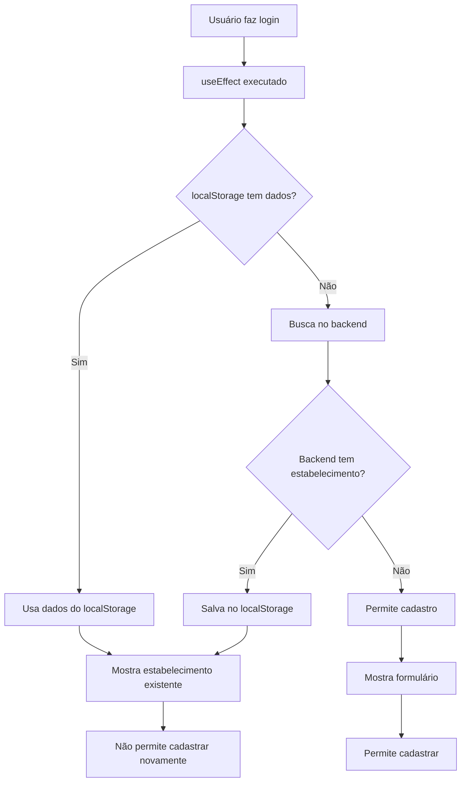

# ✅ SOLUÇÃO: Estabelecimento não voltava após cadastro

## 🔍 PROBLEMA IDENTIFICADO

Quando um usuário jurídico cadastrava um estabelecimento:
- ✅ **Estabelecimento era salvo no banco de dados**
- ✅ **localStorage era atualizado com os dados**
- ❌ **Mas ao fazer login novamente, o estabelecimento não era recuperado**
- ❌ **Sistema permitia cadastrar novamente (duplicação)**

### Causa Raiz
O `useEffect` em `CadastroEstabelecimento.tsx` **APENAS** verificava o localStorage, mas **NUNCA** buscava do backend quando o localStorage estava vazio.

## 🔧 SOLUÇÃO IMPLEMENTADA

### Arquivo Modificado
`/src/pages/empresa/CadastroEstabelecimento.tsx`

### Mudanças Realizadas

#### 1. **Fluxo Completo de Verificação**
```typescript
const verificarEstabelecimentoCompleto = async () => {
  // 1. Verifica localStorage primeiro (mais rápido)
  // 2. Se não encontrar, busca no backend
  // 3. Se encontrar no backend, salva no localStorage
  // 4. Atualiza interface com dados corretos
}
```

#### 2. **Busca no Backend**
```typescript
// Se não tem no localStorage, busca no backend
const resultado = await verificarEstabelecimento()
if (resultado.possuiEstabelecimento && resultado.estabelecimento) {
  // Estabelecimento encontrado no backend!
  const estabelecimento = resultado.estabelecimento
  
  // Salva no localStorage para próximas consultas
  localStorage.setItem('estabelecimentoId', estabelecimento.id.toString())
  localStorage.setItem('estabelecimentoNome', estabelecimento.nome)
  localStorage.setItem('estabelecimentoUserId', user.id.toString())
  
  // Atualiza interface
  setJaTemEstabelecimento(true)
  setEstabelecimentoExistente(estabelecimento)
}
```

#### 3. **Logs Detalhados**
```typescript
console.log('🔍 CadastroEstabelecimento: Verificando estabelecimento para usuário:', user.id)
console.log('✅ CadastroEstabelecimento: Estabelecimento encontrado no localStorage:', estabelecimentoNome)
console.log('🔍 CadastroEstabelecimento: Não encontrado no localStorage, buscando no backend...')
console.log('📡 CadastroEstabelecimento: Resposta do backend:', resultado)
console.log('✅ CadastroEstabelecimento: Estabelecimento encontrado no backend:', estabelecimento.nome)
```

## 🎯 RESULTADO ESPERADO

### Cenário 1: Primeiro Acesso (localStorage vazio)
1. **Usuário faz login** → localStorage vazio
2. **Sistema busca no backend** → encontra estabelecimento cadastrado
3. **Dados salvos no localStorage** → para próximas consultas
4. **Interface atualizada** → mostra que já tem estabelecimento
5. **Não permite cadastrar novamente** → evita duplicação

### Cenário 2: Acessos Subsequentes (localStorage preenchido)
1. **Usuário faz login** → localStorage tem dados
2. **Sistema usa localStorage** → mais rápido
3. **Interface atualizada imediatamente** → sem delay de API

### Cenário 3: Usuário sem Estabelecimento
1. **Usuário faz login** → localStorage vazio
2. **Sistema busca no backend** → não encontra estabelecimento
3. **Interface permite cadastro** → formulário liberado
4. **CNPJ pré-preenchido** → se disponível no perfil

## 🧪 COMO TESTAR

### Teste 1: Usuário com Estabelecimento Cadastrado
1. **Limpe o localStorage** (F12 → Application → Local Storage → Clear)
2. **Faça login** como usuário jurídico que já tem estabelecimento
3. **Vá para** `/empresa/cadastro-estabelecimento`
4. **✅ Deve mostrar:** "Você já possui um estabelecimento cadastrado"
5. **✅ Deve exibir:** Nome, CNPJ e telefone do estabelecimento
6. **✅ Não deve permitir:** Cadastrar novamente

### Teste 2: Usuário sem Estabelecimento
1. **Faça login** como usuário jurídico novo (sem estabelecimento)
2. **Vá para** `/empresa/cadastro-estabelecimento`
3. **✅ Deve mostrar:** Formulário de cadastro
4. **✅ Deve pré-preencher:** CNPJ se disponível no perfil

### Teste 3: Logs de Debug
1. **Abra o console** (F12 → Console)
2. **Faça login** e acesse a página
3. **✅ Deve mostrar logs:** Detalhados sobre o processo de verificação

## 🔄 FLUXO TÉCNICO



## 📋 BENEFÍCIOS

✅ **Sincronização completa** entre frontend e backend
✅ **Performance otimizada** (localStorage como cache)
✅ **Evita duplicação** de estabelecimentos
✅ **Logs detalhados** para debug
✅ **Experiência consistente** independente do estado do localStorage
✅ **Recuperação automática** após limpeza de cache/cookies

## 🚀 STATUS

**✅ IMPLEMENTADO E PRONTO PARA TESTE**

A solução está completa e deve resolver o problema de estabelecimentos não sendo recuperados após o login.
